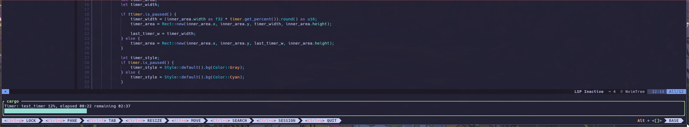

## Description:
A small rust timer that uses ratui and displays a percentage bar with the time that has elapsed.
A bar with the height of the terminal is created. The width is the width's % of the timer.

This is just to learn a bit about TUI libraries and to practice a bit of Rust, not intended to be perfect.

## Usage: 
Run it with the name of the timer and the time (in minutes) of the timer.

You can: 
- Pause the timer (Press space)
- Resume the timer (Press space)
- Quit (Press 'q' or 'Esc')

See example: 

